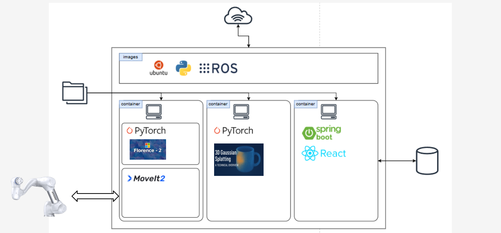
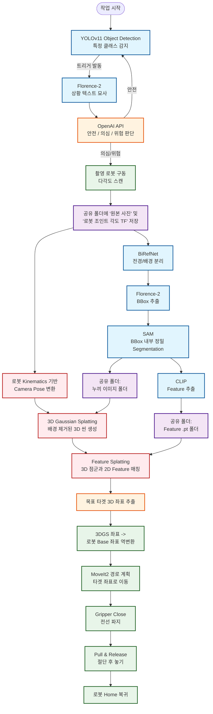

# 💣 [2D to 3D 스캐닝 및 EOD(폭발물 처리) 로봇팔]
> **조 이름:** 폭발물 처리반
> **팀원:** 박승호, 손경만, 김세훈, 이주학, 문형철

## 🎥 1. 프로젝트 시연 영상 (Demo Video)

<p align="center">
  <a href="[https://www.youtube.com/watch?v=0dqowlO3JVI](https://www.youtube.com/watch?v=0dqowlO3JVI)">
    
  </a>
</p>

<p align="center">
  
</p>

<br/>

## 2. 🎨 시스템 설계 및 플로우 차트
프로젝트의 전체적인 구조와 소프트웨어 흐름도입니다.

### 2-1. 시스템 설계도 (System Architecture)


### 2-2. 플로우 차트 (Flow Chart)


<br/>

## 3. 🛠️ 사용 장비 목록 (Hardware List)
본 프로젝트에 활용된 주요 하드웨어 장비입니다.

| 장비명 (Model) | 수량 | 제조사 / 비고 |
| :--- | :---: | :--- |
| **m0609** | 1 | Doosan Robotics (6축 협동 로봇 팔) |
| **RG6** | 1 | OnRobot (2-Finger 전동 그리퍼) |
| **Realsense 435i** | 1 | Intel (RGB-D Depth 카메라) |
| **PC / Laptop** | 3 | MSI, Lenovo(Legion), Apple(MacBook) |
| **모니터** | 1 | Samsung (상태 모니터링용) |

<br/>

## 4. 📦 의존성 및 기술 스택 (Dependencies)

<p align="center">
  
</p>

프로젝트의 각 계층별로 사용된 프레임워크와 라이브러리 목록입니다.

### 🖥️ OS 및 Core 환경
| Category | Technology / Language | Version |
| :--- | :--- | :--- |
| **OS** | Ubuntu LTS (Jammy Jellyfish) | 22.04 |
| **Language** | Python / C++ | 3.10.x / 17 |

### 🤖 Robot Control (ROS 2 & MoveIt)
| Package / Library | Description | Version |
| :--- | :--- | :--- |
| **ROS 2** | 로봇 시스템 코어 및 노드 통신 (rclpy, rclcpp) | Humble |
| **MoveIt 2** | 로봇 팔 경로 계획 (Motion Planning) 및 충돌 회피 | Humble |
| **DSR_ROBOT2** | Doosan 로봇 공식 제어 API 및 하드웨어 인터페이스 | - |
| **realsense2_camera**| Intel Realsense 카메라 ROS 2 드라이버 | - |

### 🧠 AI & Vision (2D/VLM Pipeline)
| Framework / Tool | Description | Version |
| :--- | :--- | :--- |
| **PyTorch** | 딥러닝 코어 엔진 (torch, torchvision) | 2.x |
| **Ultralytics** | YOLOv11 (위험물 실시간 Object Detection) | 최신 |
| **Transformers** | Florence-2 (이미지 캡셔닝/BBox 추출), CLIP (Feature 추출) | 최신 |
| **BiRefNet** | 고정밀 전경/배경 분리 (Background Removal) | - |
| **Segment Anything** | SAM (정밀 Segmentation Mask 생성) | - |
| **OpenAI API** | GPT-4o 등 VLM을 활용한 지휘관 AI (위험도 판별) | - |
| **Whisper** | (STT) 음성 인식 명령 처리를 위한 모델 | - |

### 🧊 3D Reconstruction & Spatial Intelligence
| Framework / Tool | Description | Version |
| :--- | :--- | :--- |
| **3DGS** | 3D Gaussian Splatting (3D 씬 재구성) | - |
| **Feature Splatting**| 3D 공간 상의 Feature 매칭 및 좌표 추출 | - |
| **Open3D** | 포인트 클라우드 및 3D 데이터 처리 | 최신 |

<br/>

## 5. ▶️ 실행 순서 (Usage Guide)
프로젝트를 실행하기 위한 명령어 순서입니다. 로봇과 카메라가 연결된 상태에서 터미널을 열고 순차적으로 실행해 주세요.

### Step 1. Realsense 카메라 및 Depth 정렬 실행
카메라를 켜고 RGB 이미지와 Depth 정보를 일치시키는 노드를 실행합니다.
```bash
ros2 launch realsense2_camera rs_align_depth_launch.py depth_module.depth_profile:=848x480x30 rgb_camera.color_profile:=640x480x30 initial_reset:=true align_depth.enable:=true enable_rgbd:=true pointcloud.enable:=true
```

### Step 2. EOD 마스터 노드 실행 (로봇 제어 및 비전 파이프라인)
새 터미널을 열고, 로봇 제어(MoveIt)와 AI 비전 파이프라인(YOLO, Florence-2, SAM 등)이 포함된 메인 런치를 실행합니다.
```bash
ros2 launch eod_detection eod_master.launch.py
```

### Step 3. 3DGS 및 로봇 통합 모듈 실행
마지막으로 새 터미널을 열고, 3D Gaussian Splatting, Feature 매칭, 좌표 변환 및 STT 음성 인식을 수행하는 통합 노드를 실행합니다.
```bash
ros2 launch 3dgs_pkg robot_integration.launch.py
```
